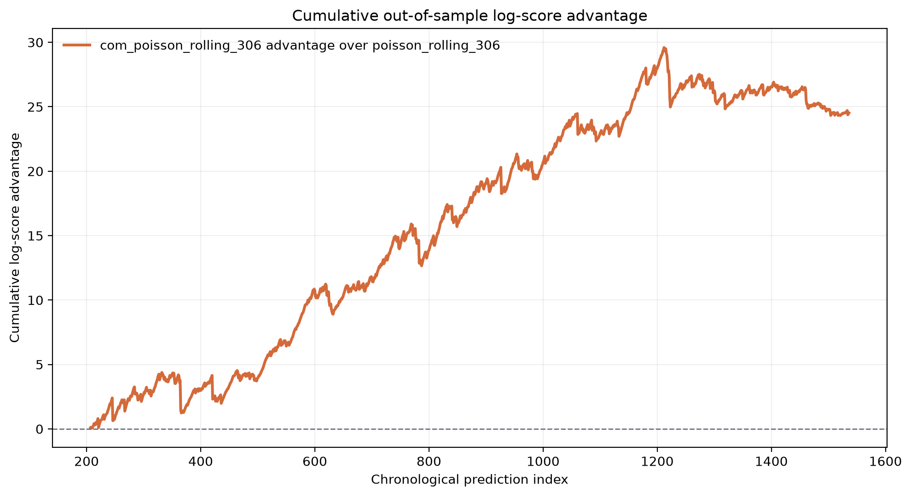
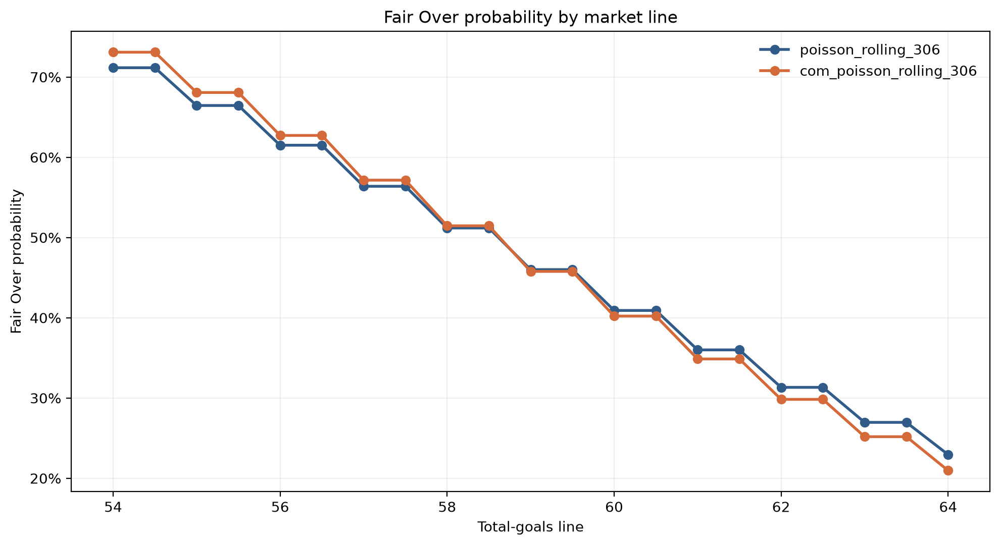

# CourtQuant


A reproducible probabilistic pricing and model-risk engine for German handball total-goals markets.

CourtQuant tests whether a dispersion-aware Conway-Maxwell-Poisson model produces better out-of-sample probability forecasts and fair market prices than a standard Poisson benchmark.

## Key result

The rolling COM-Poisson model achieves the best probabilistic performance across 1,330 out-of-sample predictions.

| Metric | Result |
|---|---:|
| Matches in dataset | 1,537 |
| Out-of-sample predictions | 1,330 |
| Evaluation matchdays | 144 |
| Rolling training window | 306 matches |
| Poisson mean negative log-score | 3.304016 |
| COM-Poisson mean negative log-score | **3.285576** |
| Relative log-score improvement | **0.558%** |
| 95% matchday-block bootstrap interval | **[-0.030803, -0.005325]** |
| Bootstrap samples favouring COM-Poisson | **99.66%** |
| Maximum pricing difference | **215.72 bps** |

The bootstrap interval refers to the paired COM-Poisson-minus-Poisson score difference. Negative values favour COM-Poisson. The bootstrap frequency measures resampling support and is not a Bayesian posterior probability.

## Why Poisson can misprice risk

A Poisson model imposes:

```text
expected value = variance
```

In the latest rolling window, both models estimate the same expected total of 58.8954 goals, but their uncertainty estimates differ:

| Model | Expected total | Variance | Dispersion index |
|---|---:|---:|---:|
| Poisson | 58.8954 | 58.8954 | 1.0000 |
| COM-Poisson | 58.8954 | 49.0627 | 0.8330 |

The handball totals are underdispersed relative to the Poisson assumption. COM-Poisson captures this narrower distribution and therefore produces different tail probabilities and fair Over/Under prices, even when both models agree on the expected score.

## Out-of-sample model ranking

| Rank | Model | Mean negative log-score | MAE | RMSE |
|---:|---|---:|---:|---:|
| 1 | **COM-Poisson rolling 306** | **3.285576** | 5.1046 | 6.4759 |
| 2 | Poisson rolling 306 | 3.304016 | 5.1046 | 6.4759 |
| 3 | COM-Poisson expanding | 3.323466 | 5.2777 | 6.7127 |
| 4 | Poisson expanding | 3.332047 | 5.2777 | 6.7127 |

MAE and RMSE are identical within each window strategy because the competing models estimate the same conditional mean. The improvement comes from better modelling of the full predictive distribution.

## Cumulative probabilistic advantage

Positive values indicate a cumulative log-score advantage for rolling COM-Poisson over rolling Poisson.



## Fair-price comparison

CourtQuant converts each fitted count distribution into:

- Under probability
- Push probability for integer lines
- Over probability
- Fair decimal Under and Over odds
- Model-risk differences in basis points

For half-goal lines, fair decimal odds are:

```text
fair odds = 1 / win probability
```

For integer lines, the returned stake in the push state is incorporated:

```text
fair odds = (1 - push probability) / win probability
```



The latest pricing surface covers lines from 54.0 to 64.0 goals. Across that range, the maximum absolute probability difference between Poisson and COM-Poisson is 215.72 basis points.

## Validation design

CourtQuant uses leakage-resistant chronological evaluation:

1. Sort all matches by season, matchday and match.
2. Fit each model using only historical observations.
3. Predict every match in the next matchday without updating within that matchday.
4. Continue through the remaining dataset using expanding and rolling windows.
5. Compare models using the negative log-score.
6. Resample complete matchdays in a paired block bootstrap.

The matchday embargo prevents information from one match on a given matchday leaking into another prediction from the same matchday.

## Components

### Data validation

- Explicit schema and type checks
- Missing-value detection
- Duplicate detection
- Handball-specific score validation
- Reproducible feature construction

### Statistical diagnostics

- Mean-variance comparison
- Dispersion-index estimation
- Season-level summaries
- Rolling distribution diagnostics

### Probability models

- Maximum-likelihood Poisson baseline
- Maximum-likelihood Conway-Maxwell-Poisson model
- Analytic gradient implementation
- Robust L-BFGS-B optimization with SLSQP fallback
- Numerically stable probability normalization and moments

### Backtesting and model risk

- Expanding-window evaluation
- Rolling-window evaluation
- Matchday-level leakage embargo
- Proper logarithmic scoring
- MAE, RMSE and forecast bias
- Paired matchday-block bootstrap
- Confidence intervals and bootstrap support

### Pricing engine

- Integer and half-goal total lines
- Under, push and Over probabilities
- Push-adjusted fair decimal odds
- Residual tail-mass controls
- Probability differences in basis points
- Pricing-surface comparison across models

## Repository structure

```text
courtquant/
├── data/
│   ├── raw/                       # Local source data
│   └── processed/                 # Generated datasets
├── notebooks/                     # Exploratory research
├── reports/
│   ├── figures/                   # Publication-ready charts
│   ├── model_summary.csv
│   ├── bootstrap_summary.csv
│   ├── pricing_surface.csv
│   ├── cumulative_score_path.csv
│   └── research_summary.md
├── scripts/
│   └── generate_report.py         # End-to-end research pipeline
├── src/courtquant/
│   ├── models/
│   │   ├── poisson.py
│   │   └── com_poisson.py
│   ├── backtesting.py
│   ├── data.py
│   ├── diagnostics.py
│   ├── evaluation.py
│   ├── pricing.py
│   └── reporting.py
├── tests/                         # Automated test suite
├── pyproject.toml
└── uv.lock
```

## Reproduce the analysis

CourtQuant uses [uv](https://docs.astral.sh/uv/) for dependency and environment management.

```bash
git clone https://github.com/benny189/courtquant.git
cd courtquant
uv sync
```

Place the source dataset at:

```text
data/raw/handball.csv
```

Run the complete quality suite:

```bash
uv run ruff check .
uv run mypy
uv run pytest
```

Expected result:

```text
200 passed
100% statement and branch coverage
```

Generate every research artifact:

```bash
uv run python scripts/generate_report.py
```

The command recreates all result tables, charts and the Markdown research summary from the raw data.

## Research artifacts

- [Research summary](reports/research_summary.md)
- [Model comparison](reports/model_summary.csv)
- [Bootstrap evaluation](reports/bootstrap_summary.csv)
- [Pricing surface](reports/pricing_surface.csv)
- [Cumulative score path](reports/cumulative_score_path.csv)

## Engineering quality

- Python 3.13
- Fully typed production and test code
- Ruff formatting and linting
- Mypy static type checking
- 200 automated tests
- 100% statement and branch coverage
- Pre-commit and pre-push quality gates
- Locked dependencies through `uv.lock`
- Deterministic bootstrap results through an explicit seed

## Data availability

The raw source dataset is not included until redistribution rights have been confirmed. See [`data/README.md`](data/README.md) for the expected schema and data-handling policy.

The committed research outputs contain aggregate model results and derived scores rather than the original match-level source data.

## Limitations

- The current models use historical aggregate goal totals without team-strength or player-level covariates.
- No bookmaker prices are used.
- The project evaluates probability quality and model-implied fair value, not betting profitability.
- Structural changes beyond the rolling window are not modelled explicitly.

## Disclaimer

CourtQuant is intended solely for statistical research, software engineering and education. It does not provide betting recommendations or financial advice.

## License

Released under the [MIT License](LICENSE).